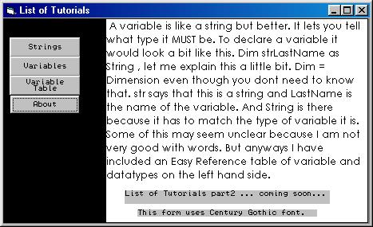



## Things you NEED to know

### Description

This is a collection of things I have acquired through websites and books. This is only part 1 of 6 , so expect more later. Good For Beginners to start learning quick.
 
### More Info
 

             |
---                |---
**Submitted On**   |2001-02-23 18:56:08
**By**             |[Zach Pratt](https://github.com/Planet-Source-Code/PSCIndex/blob/master/ByAuthor/zach-pratt.md)
**Level**          |Beginner
**User Rating**    |4.3 (13 globes from 3 users)
**Compatibility**  |VB 3\.0, VB 4\.0 \(16\-bit\), VB 4\.0 \(32\-bit\), VB 5\.0, VB 6\.0
**Category**       |[Coding Standards](https://github.com/Planet-Source-Code/PSCIndex/blob/master/ByCategory/coding-standards__1-43.md)
**World**          |[Visual Basic](https://github.com/Planet-Source-Code/PSCIndex/blob/master/ByWorld/visual-basic.md)
**Archive File**   |[CODE\_UPLOAD153512222001\.zip](https://github.com/Planet-Source-Code/zach-pratt-things-you-need-to-know__1-21249/archive/master.zip)

